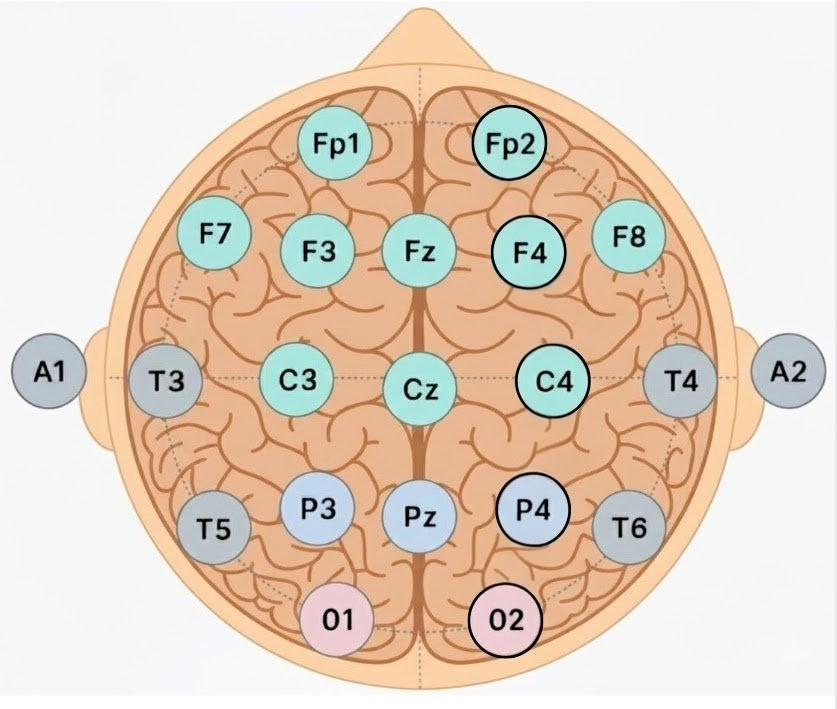
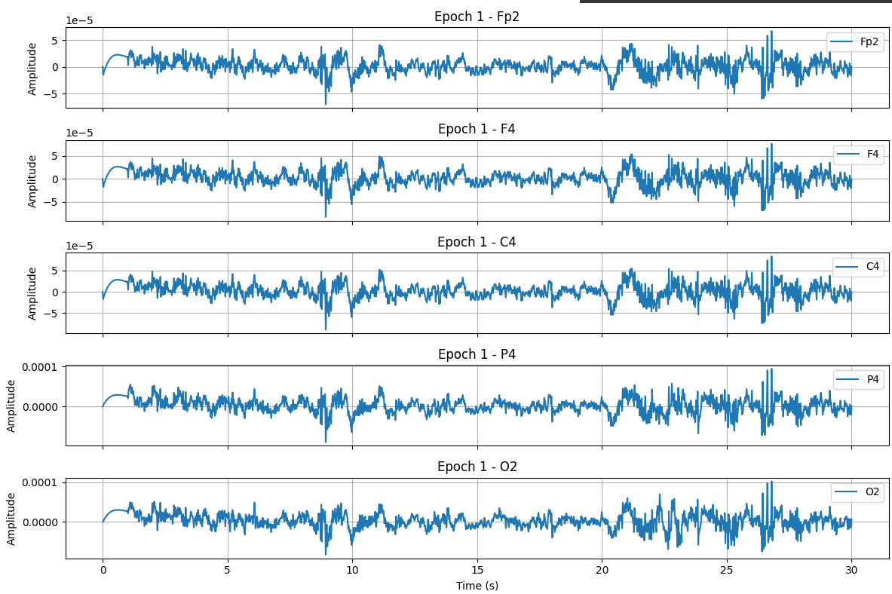
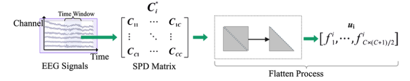

# Machine Learning-Based Identification of Narcolepsy: A Channel-Specific EEG Approach

This repository presents an end-to-end implementation of an **EEG-based machine learning framework** for the automated identification of narcolepsy. The project integrates biomedical signal processing, multi-domain feature extraction, ensemble learning models, and explainable AI to support early and reliable narcolepsy detection.

---

## 📌 Project Motivation

Narcolepsy is a chronic neurological sleep disorder characterized by excessive daytime sleepiness and abnormal REM sleep intrusions. Conventional diagnostic techniques such as polysomnography (PSG) and the Multiple Sleep Latency Test (MSLT) are expensive, time-consuming, and require clinical infrastructure.  

This project explores the potential of **EEG signal analysis combined with machine learning** as a cost-effective, scalable, and interpretable alternative for narcolepsy detection.

---

## 📊 Dataset Information

- **Dataset:** CAP Sleep Database  
- **Source:** PhysioNet  
- **Link:** https://physionet.org/physiobank/database/capslpdb/  

### Subjects Used
- 5 Healthy subjects  
- 5 Narcoleptic subjects  

> Although the database contains more healthy recordings, only a balanced subset was selected due to corrupted files, inconsistent sampling rates, and to avoid class imbalance.

---

## 🧠 EEG Signal Overview

### EEG 10–20 Electrode Montage

### EEG Electrodes

---
## 🔁 Proposed Methodology Flowchart

The complete pipeline—from raw EEG to classification—is illustrated below:

---
## 🔧 EEG Preprocessing

The EEG signals undergo multiple preprocessing steps to improve signal quality and physiological interpretability.

### Bipolar to Unipolar Conversion

### Preprocessing Steps
- Bandpass filtering (0.1–30 Hz)
- Noise suppression
- Artifact removal using Independent Component Analysis (ICA)

### ICA Artifact Removal Examples
**Narcoleptic EEG**

**Normal EEG**

---

## ⏱️ Epoch Segmentation

Preprocessed EEG signals are segmented into **30-second non-overlapping epochs**, a standard practice in sleep analysis.

---

## 🔍 Feature Extraction

A rich set of EEG features was extracted from each epoch across multiple domains:

- Time-domain statistics  
- Frequency-domain band powers (absolute & relative)  
- Time-frequency features (STFT, Wavelets)  
- Entropy-based features  
- Hjorth parameters  
- Nonlinear dynamics  
- Inter-channel coherence features  

### EEG Feature Extraction Overview

---

## 🧩 Feature Flattening

Extracted multi-channel features were flattened into a single 1D feature vector to make them compatible with classical machine learning models.

---

## 🤖 Machine Learning Models

The following supervised models were trained and evaluated:

- Logistic Regression  
- Support Vector Machine (SVM)  
- Gaussian Naive Bayes  
- K-Nearest Neighbors (KNN)  
- Random Forest  
- AdaBoost  
- Gradient Boosting  
- XGBoost  
- LightGBM  

### Validation Strategy
- Model performance was evaluated using **3-fold stratified cross-validation** to preserve class distribution across folds.
- **Optuna** was employed for automated hyperparameter optimization.
- Models were assessed using **Balanced Accuracy, Area Under the ROC Curve (AUC), Gini Coefficient, and KS Statistic**.

---

## 📈 Model Evaluation & Explainability

### ROC Curve – AdaBoost (Multi-Channel)

### Confusion Matrix – AdaBoost (Multi-Channel)

### SHAP-Based Feature Importance

SHAP analysis confirms that the models rely on **physiologically meaningful EEG features**, improving transparency and trust.

---

## 📊 Final Results Summary

| Channel | Best Model | Balanced Accuracy | AUC   | Gini  | KS    |
|------------------------|------------|-------------------|-------|-------|-------|
| Fp2                    | SVM        | 0.5236            | 0.4689| 0.062 | 0.160 |
| F4                     | SVM        | 0.3757            | 0.2327| 0.535 | 0.518 |
| C4                     | AdaBoost   | 0.4556            | 0.4235| 0.153 | 0.155 |
| P4                     | GaussianNB | 0.4258            | 0.3865| 0.227 | 0.213 |
| O4                     | GaussianNB | 0.3927            | 0.2853| 0.429 | 0.353 |
| **Multi-Channel**      | **AdaBoost** | **0.9837** | **0.9988** | **0.9975** | **0.9694** |

> Multi-channel EEG integration significantly outperforms single-channel analysis, confirming that narcolepsy-related EEG abnormalities are distributed across brain regions.

---

## ✅ Key Outcomes

- Multi-channel EEG models achieve near-perfect classification performance
- Ensemble learners outperform linear models
- Channel-wise analysis alone is insufficient
- SHAP enhances model interpretability
- Strong potential for clinical decision-support systems

---

## 👨‍💻 Project Team

**Project Team**
| Team Member | Roll No. |
|------|----------|
| Rohit Chachra | UE228087 |
| Sehajdeep Singh Saini | UE228090 |
| Rahul Grover | UE228083 |
| Raj Kumar | UE228084 |

**Mentor**  
Dr. Neelam Goel  
Assistant Professor, Department of IT  

**Institute**  
UIET, Panjab University, Chandigarh  

---

## 📜 License

This project is intended strictly for **academic and research purposes**.

---

⭐ *If you find this work useful, feel free to star the repository.*
